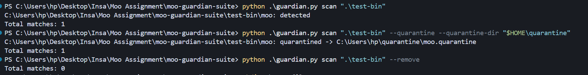
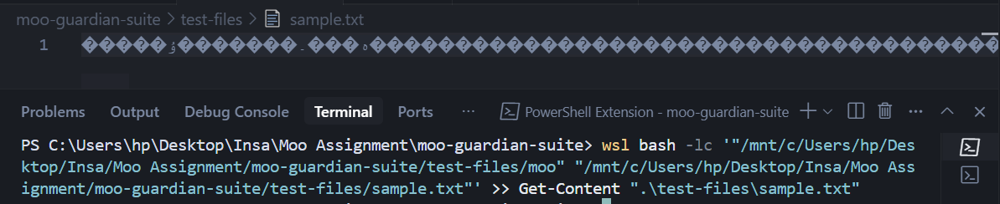
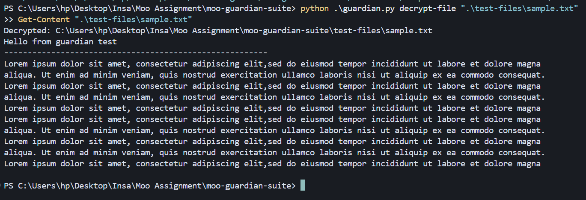

## Overview

This is a small security toolkit to defend against the teaching malware "moo". It detects the exact moo binary by fingerprint (SHA-256), can quarantine or remove it, and can decrypt files that moo scrambled. It is designed for classroom/lab use only.

How it works at a glance:
- Detection: computes SHA-256 for files and compares against the known moo hash in `signatures.json`.
- Quarantine/Remove: either moves the detected binary to a safe folder or deletes it.
- Decryption: applies the inverse transform of moo to restore scrambled files.

## Features
- Detect moo by exact SHA-256 fingerprint
- Quarantine or remove detected moo binaries (mutually exclusive options)
- Decrypt a single file or all files under a directory (recursive)
- Single merged CLI (`guardian.py`) with subcommands: `scan`, `decrypt-file`, `decrypt-dir`

## Safety
- Only test in lab folders with disposable files you created for this purpose.
- Do not run remove/decrypt on real documents. Always keep backups.

## Usage

Scan a directory (detect only):
```bash
python guardian.py scan "."
```

Scan and quarantine detections:
```bash
python guardian.py scan "." --quarantine --quarantine-dir "~/quarantine"
```

Remove detections (destructive; use only on test copies):
```bash
python guardian.py scan "." --remove
```

Decrypt a single file in-place:
```bash
python guardian.py decrypt-file path/to/file
```

Decrypt all files under a directory in-place (CAUTION: only use on test dirs):
```bash
python guardian.py decrypt-dir path/to/dir
```

### Recursive scan examples
- Current folder (recursive):
```bash
python guardian.py scan "."
```
- Specific folder (recursive):
```bash
python guardian.py scan "C:\\Users\\hp\\Downloads"
```
- Whole drive (slow; recommend quarantine dir):
```bash
python guardian.py scan "C:\\" --quarantine --quarantine-dir "$HOME/quarantine"
```

### Batch decrypt
Restore many files at once by decrypting a directory recursively:
```bash
python guardian.py decrypt-dir ".\\test-files"
```

## Signatures and fingerprints
- Detection is by exact SHA-256 in `signatures.json` (key: `moo_sha256`).
- To customize, replace the value with your moo build's SHA-256.
- If you maintain multiple moo builds, you can extend the code to check a list of hashes; otherwise update the single value as needed.

How to get the SHA-256 of your moo binary:
- Windows PowerShell:
```powershell
Get-FileHash -Algorithm SHA256 .\path\to\moo | Select-Object -ExpandProperty Hash
```
- WSL/Linux:
```bash
sha256sum ./moo
```
Then edit `signatures.json` and set the `moo_sha256` value to the 64-character hash string.

## Demo evidence
<div align="center">

### Screenshots

<div style="display:flex; flex-direction:column; gap:12px; align-items:center;">


*Detect, Quarantine, Remove*


*sample.txt encrypted by moo*


*sample.txt decrypt by python guardian.py decrypt-file path/to/file*
</div>

</div>

